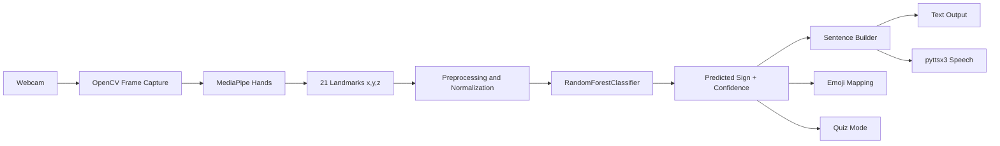

# System Architecture

## Overview

The system is a local Streamlit application that uses a webcam to recognize selected hand signs. It combines computer vision, feature extraction, machine learning classification, sentence construction, emoji mapping, speech synthesis, and quiz feedback.



## Main Components

### 1. Webcam Input

`app.py` and `dataset_collector.py` use OpenCV to read webcam frames from `CAMERA_INDEX`.

### 2. Hand Tracking

`src/hand_tracker.py` wraps MediaPipe Hands. It detects one hand and extracts 21 landmarks. Each landmark contains:

- `x`: horizontal normalized coordinate
- `y`: vertical normalized coordinate
- `z`: relative depth

Total features per sample:

```text
21 landmarks x 3 values = 63 features
```

### 3. Dataset Collection

`src/dataset_collector.py` saves one CSV file per sign inside `data/keypoints/`.

Example:

```text
data/keypoints/hello.csv
data/keypoints/water.csv
```

Each row contains:

- label
- `f1` to `f63` normalized landmark values

Optional raw images can be stored inside `data/raw_images/`.

### 4. Preprocessing

`src/preprocess.py` normalizes landmark vectors by:

1. Reshaping 63 values into a 21 x 3 array
2. Subtracting the wrist landmark from all landmarks
3. Scaling by the largest distance from the wrist

This improves robustness against hand position and hand size differences.

### 5. Model Training

`src/train_model.py` loads all CSV files, normalizes the samples, encodes labels, trains a scikit-learn `RandomForestClassifier`, and saves:

```text
models/gesture_model.pkl
models/label_encoder.pkl
```

### 6. Prediction

`src/predictor.py` loads the saved model files and predicts signs from live landmarks. It returns:

- predicted label
- confidence score
- status message
- top class scores

If the confidence score is below the configured threshold, the app shows:

```text
Gesture not clear
```

If no landmarks are detected, the app shows:

```text
No hand detected
```

### 7. Sentence Builder

`src/sentence_builder.py` accepts only stable predictions, then converts signs into short meaningful sentences such as:

- `hello` -> `Hello.`
- `help` -> `I need help.`
- `please + water` -> `Please give me water.`
- `thank_you` -> `Thank you.`

### 8. Emoji Mapping

`assets/emojis.json` maps each sign to an emoji used by the UI.

### 9. Text-to-Speech

`src/text_to_speech.py` uses pyttsx3 to speak the generated sentence locally.

### 10. Quiz Mode

`src/quiz_mode.py` selects a random target sign and checks the user's prediction. It tracks:

- score
- attempts
- accuracy percentage

## Data Flow

```text
Frame -> Hand landmarks -> Normalized features -> Classifier -> Sign -> Sentence/Emoji/Speech/Quiz
```

## MVP Boundaries

This project focuses on a small static-sign dataset and one-hand recognition. It is suitable for demonstration and learning, not for replacing a complete sign-language interpreter.
